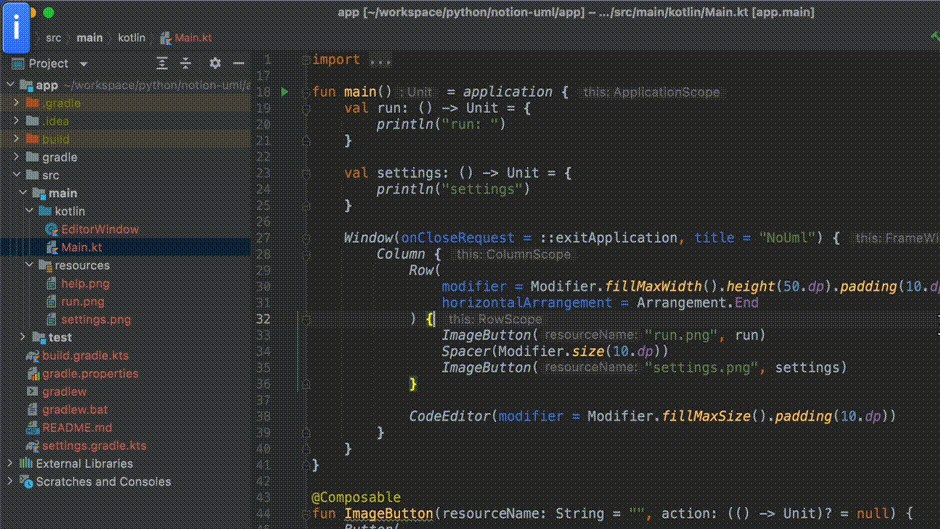

### Compose Desktop code editor

This Compose Desktop app embeds a [RSyntaxTextArea](https://github.com/bobbylight/RSyntaxTextArea) in a Composable function.

It uses App State to observe the text inside the code editor.


The code editor can be used as a @Composable function
```Kotlin
// editor text is a state object
val editorText = remember { mutableStateOf("@plantuml\n\n@end") }

Column {
    CodeEditor(editorText, modifier = Modifier.fillMaxSize().padding(10.dp))
}

```

## Run

`./gradlew run`


## Demo

